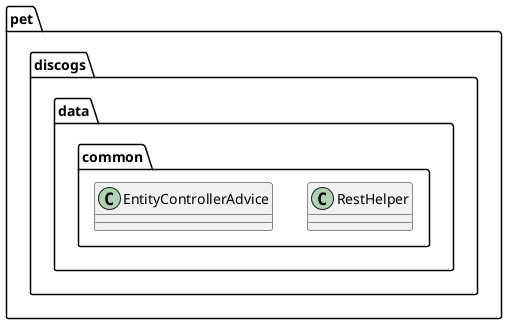

# AGENTS.md - Discogs Project Guide

A Spring Boot 4.0 REST API for managing musicians, groups, and musical recordings with HATEOAS hypermedia support.

## Architecture Overview

**Three-tier domain model pattern** with cross-cutting concerns:

- **Domain Entities** (`Person`, `Group`, `Recording`) in `pet.discogs.data.{person,group,recording}`
- **Value Objects** (`Country`, `Gender`, `Genre`, `Instrument`, `RecordingType`) in `pet.discogs.data.values`
- **HATEOAS Assemblers** for each entity that add hypermedia links
- **Controllers** following REST conventions with PUT/PATCH/DELETE support

**Critical TODO items** scattered in code signal incomplete JPA relations:

- `Person.java`: "TODO Set up JPA relations to Group and Recordings" (line 14)
- Cross-entity endpoints mock data instead of querying relationships (see `PersonController.getGroups()`, lines 97-103)

## Project Structure

```
src/main/java/pet/discogs/
├── data/
│   ├── common/              # Shared utilities
│   │   ├── RestHelper       # HTTP response builders + copyAttribute() for PATCH/PUT
│   │   └── EntityControllerAdvice  # Global exception handler for EntityNotFoundException
│   ├── {person,group,recording}/
│   │   ├── {Entity}.java                   # JPA @Entity with equals/hashCode/toString
│   │   ├── {Entity}Repository.java         # Spring Data JPA interface
│   │   ├── {Entity}Controller.java         # REST @RestController
│   │   └── {Entity}ModelAssembler.java    # RepresentationModelAssembler for HATEOAS
│   └── values/             # Enums only (Country, Gender, Genre, Instrument, RecordingType)
└── data/MockData.java      # ApplicationRunner that seeds H2 on startup
```

## Key Patterns & Conventions

### 1. HATEOAS Link Generation Pattern

Every entity has a `ModelAssembler` implementing `RepresentationModelAssembler<T, EntityModel<T>>`:

```java
// PersonModelAssembler example
EntityModel.of(person,
               linkTo(methodOn(PersonController.class).

getPerson(id)).

withSelfRel(),

linkTo(methodOn(PersonController.class).

getPersons()).

withRel("persons"));
```

**Convention**: Links are built using `linkTo(methodOn(ControllerClass.method))` from
`org.springframework.hateoas.server.mvc`.

### 2. PUT vs PATCH Implementation

`RestHelper.copyAttribute()` method handles conditional null copying:

```java
// PUT: replaces all attributes (copyNulls=true)
copyAttributes(newEntity, existing, true)

// PATCH: only updates non-null attributes (copyNulls=false)
copyAttributes(newEntity, existing, false)
```

Apply this pattern when adding new controllers.

### 3. Entity & Repository Naming

- Repositories extend `JpaRepository<Entity, Long>` with no custom queries yet
- All entities use `@Id @GeneratedValue(strategy = GenerationType.IDENTITY)`
- `Group` entity mapped to table `ENSEMBLE` (SQL keyword workaround, line 11 in Group.java)
- Note: `Recording.yearr` has intentional typo to avoid SQL reserved word (TODO to fix)

### 4. Value Objects as Enums

Enums in `data/values/` used as `@Enumerated` fields:

- `Country`, `Gender`, `Genre`, `Instrument`, `RecordingType`
- Static imports in `MockData` for convenience

### 5. Exception Handling

`@RestControllerAdvice` catches `EntityNotFoundException` and returns HTTP 404.
Extend `EntityControllerAdvice` for domain-specific exceptions.

## Critical Workflows

### Build & Run

```bash
# Maven build (Java 25 required, see pom.xml line 42)
./mvnw clean package

# Run Spring Boot app (starts MockData seeding)
./mvnw spring-boot:run
```

### Database & Development

- **H2 in-memory database** with DDL auto-creation (`application.yaml` line 10: `ddl-auto: create`)
 - H2 console enabled (path configured in `application.yaml` at lines 18-21; default URL `http://localhost:8080/h2`)
- SQL logging enabled by default in `application.yaml` (lines 11-15)
- **DevTools enabled** for hot reload on file changes

### Data Initialization

`MockData.java` implements `ApplicationRunner`:

- Runs AFTER context initialization
- Seeds 12 Persons (Pat Metheny Group, Pink Floyd, Locomotiv GT)
- Seeds 3 Groups + 9 Recordings
- Logs all data to console via SLF4J Logger

**Important note** (line 10-14 in DiscogsApplication.java): Main method runs twice—once by Java and once by Spring
Restarter. Don't put initialization logic in `main()`, use `ApplicationRunner` beans instead.

## REST API Endpoints (Established Pattern)

All controllers follow this template:

```
GET    /persons           → CollectionModel with HATEOAS links
POST   /persons           → Creates entity, returns 201 + EntityModel
GET    /persons/{id}      → Single EntityModel
PUT    /persons/{id}      → Full replace (copyNulls=true)
PATCH  /persons/{id}      → Partial update (copyNulls=false)
DELETE /persons/{id}      → 204 No Content

GET    /persons/{id}/groups      → Nested collection (mock data for now)
GET    /persons/{id}/recordings  → Nested collection (mock data for now)
```

Same pattern applies to `/groups` and `/recordings` endpoints.

## Adding a New Feature Checklist

1. **Extend domain model**: Add fields to entity, update `equals()`, `hashCode()`, `toString()`
2. **Update repository**: Extend `JpaRepository` with custom queries if needed
3. **Extend controller**: Add endpoints, use `RestHelper.copyAttribute()` for PUT/PATCH
4. **Create ModelAssembler**: Implement `RepresentationModelAssembler`, add links in `toModel()`
5. **Seed test data**: Add to `MockData.run()` for local testing
6. **Fix TODOs**: Look for `// TODO` comments—many relate to missing JPA relations

## Dependencies & Versions

- **Spring Boot 4.0.6**
- **Java 25** (note the unusual version)
- **Spring Data JPA**, **Spring HATEOAS**, **H2 Database**, **DevTools**, **Actuator**
- **JetBrains @NotNull annotations**

## Known Limitations & TODOs

1. **No JPA relations** between entities (Persons-Groups, Persons-Recordings)—cross-entity endpoints currently hardcoded
   with IDs
2. **Column name conflicts**: `Recording.yearr` and `Group` table name are workarounds
3. **Entity exception messages** only return raw Hibernate messages (line 16, EntityControllerAdvice)
4. **Conditional links** in ModelAssemblers not yet implemented (noted line 25, PersonModelAssembler)



> [!NOTE]
> This guide is a living document. As you work on the project, update this file with new patterns, conventions, and
> TODOs you encounter. The goal is to create a comprehensive reference for current and future developers working on the
> Discogs project.
